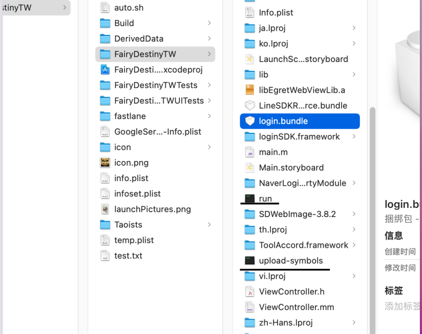

# 海外SDK IOS 使用文档

- SDK集成了登录，支付等功能。本文档详细说明相关功能在技术对接与使用过程中需要注意的地方，以便贵方能快速对接。阅读后如有疑问，请联系GM88游戏相关技术支持。
- SDK目前支持语言有：简体中文，繁体中文，繁体中文（台湾），繁体中文（香港），英语，西班牙语，德语，法语，印度尼西亚语，越南语，韩语，日语，意大利语，马来语，葡萄牙语，俄语，泰语

# 导入SDK

将lognSDK.framework 和login.bundle导入到您的工程中。

## 项目参数配置

1. **login.bundle内的infoset.plist**

如没有拿到参数使用默认即可

| 参数名             | 类型     | 默认值                                                                                    | 说明                                |
| --------------- | ------ | -------------------------------------------------------------------------------------- | --------------------------------- |
| gameid          | string | 1700                                                                                   | 提供的游戏ID                           |
| issueVersion    | string | 1700001                                                                                | 每次更新包需要修改                         |
| sdkVersion      | string | 2.5                                                                                    | 更新SDK不想整体替换login.bundle需要注意是否需要修改 |
| requestUrl      | string |                                                                                        | 游戏需要使用特殊域名填入给到域名默认为空              |
| appleAppID      | string | 1475870720                                                                             | 苹果默认应用id                          |
| appsFlyerDevKey | string | g7ZP9TqQ4S8AF9zeQD9Koe                                                                 | appsFlyer的key                     |
| GGkClientID     | string | 728..33nej...juerv.nt.com                                                              | 谷歌的ClientID                       |
| ConsumerKey     | string | SALb45SZfATPS8ILSYAvnB4ic                                                              | Twitter的key                       |
| consumerSecret  | string | lGoFe4yYVug52LcNiAptoAB                                                                | Twitter的Secret                    |
| loginType       | string | 0                                                                                      | 不使用SDK登陆页面使用登陆方法开启填入1             |
| preloadad       | string | 0                                                                                      | 默认为0 控制启动应用是否开启预加载广告              |
| aihelpAppkey    | string | immortaltaoists_app_a...22e33de529173                                                  | 客服参数                              |
| aihelpAppId     | string | immortaltaoists_platfor...ae098aea0785750                                              | 客服参数                              |
| aihelpAppId     | string | immortaltaoists.aihelp.net                                                             | 客服参数                              |
| AppLovinSdkKey  | string | OixDcmXAyNNGd4zM3r-h0fsGvPzKc8k0sfETQmdM80dn4b77R6qSmfif4f-hpiheMw7ogl9plnZqNhyqomGTQz | 广告，没有提供使用默认值即可                    |

**2. 项目info.plist参数添加**

| 参数名                                                 | 类型         | 默认值                                                                       | 说明       |
| --------------------------------------------------- | ---------- | ------------------------------------------------------------------------- | -------- |
| FacebookAppID                                       | string     | 434430780481846                                                           | fb应用id   |
| FacebookClientToken                                 | string     | 65a34cf1b4b4ab393d6fbb5c994cbfdc                                          | fbtoken  |
| FacebookDisplayName                                 | string     | 仙命決                                                                       | 基本和应用同名  |
| GADIsAdManagerApp                                   | bool       | 1                                                                         | 不添加会引起崩溃 |
| GADApplicationIdentifier                            | string     | ca-app-pub-7496069579613989~8545461470                                    | 谷歌广告应用ID |
| Privacy - Camera Usage Description                  | string     | Need access to use your camera                                            | 权限       |
| Privacy - Photo Library Additions Usage Description | string     | For better service，please authorize Photo Album                           | 权限       |
| Privacy - Photo Library Usage Description           | string     | For better service，please authorize Photo Album                           | 权限       |
| Privacy - Tracking Usage Description                | string     | The ads will be matched to your preferences for better gaming experience. | 权限       |
| URL types                                           | array      |                                                                           | scheme   |
| LSApplicationQueriesSchemes                         | array      |                                                                           | 白名单      |
| SKAdNetworkItems                                    | array      |                                                                           | 广告       |
| LineSDKConfig                                       | dictionary |                                                                           | lineID   |

**可用Source Code 模式打来info.plist 进行添加**

**URL types**

```
<key>CFBundleURLTypes</key>
<array>
  <dict>
    <key>CFBundleTypeRole</key>
    <string>Editor</string>
    <key>CFBundleURLName</key>

    <!-- 谷歌 clientSecret   -->
    <string>com.googleusercontent.apps.726483388833-nejr29g354f0p3sieg18gmehkhljuerv</string>
    <key>CFBundleURLSchemes</key>
    <array>
      <!-- 谷歌 clientSecret   -->
      <string>com.googleusercontent.apps.726483388833-nejr29g354f0p3sieg18gmehkhljuerv</string>
    </array>
  </dict>
  <dict>
    <key>CFBundleTypeRole</key>
    <string>Editor</string>
    <key>CFBundleURLSchemes</key>
    <array>
      <!--  line 默认形式即可 -->
      <string>line3rdp.$(PRODUCT_BUNDLE_IDENTIFIER)</string>
    </array>
  </dict>
  <dict>
    <key>CFBundleTypeRole</key>
    <string>Editor</string>
    <key>CFBundleURLSchemes</key>
    <array>
      <!--  fb+fb应用id -->
      <string>fb{fb应用id}</string>
    </array>
  </dict>
  <dict>
    <key>CFBundleTypeRole</key>
    <string>Editor</string>
    <key>CFBundleURLSchemes</key>
    <array>
      <!--  twitter+Twitter的key -->
      <string>twitterkit-{twitter-key}</string>
    </array>
  </dict>
      <dict>
            <key>CFBundleTypeRole</key>
            <string>Editor</string>
            <key>CFBundleURLSchemes</key>
            <array>
         <!--  gmgame+游戏名称简拼 -->
                <string>gmgameyxmc</string>
            </array>
        </dict>
    </array>
```

**LSApplicationQueriesSchemes**

```
<key>LSApplicationQueriesSchemes</key>
    <array>
        <string>instagram-stories</string>
        <string>facebook-stories</string>
        <string>lobi</string>
        <string>fb</string>
        <string>lineauth2</string>
        <string>instagram</string>
        <string>lineauth</string>
        <string>line3rdp.$(PRODUCT_BUNDLE_IDENTIFIER)</string>
        <string>line</string>
        <string>fbapi</string>
        <string>fbapi20130214</string>
        <string>fbapi20130410</string>
        <string>fbapi20130702</string>
        <string>fbapi20131010</string>
        <string>fbapi20131219</string>
        <string>fbapi20140410</string>
        <string>fbapi20140116</string>
        <string>fbapi20150313</string>
        <string>fbapi20150629</string>
        <string>fbapi20160328</string>
        <string>fbauth</string>
        <string>fb-messenger-share-api</string>
        <string>fbauth2</string>
        <string>fbshareextension</string>
        <string>naversearchapp</string>
        <string>naversearchthirdlogin</string>
        <string>twitter</string>
        <string>twitterauth</string>
    </array>
```

**SKAdNetworkItems**

```
<key>SKAdNetworkItems</key>
    <array>
       <dict>
    <key>SKAdNetworkIdentifier</key>
    <string>2fnua5tdw4.skadnetwork</string>
</dict>
<dict>
    <key>SKAdNetworkIdentifier</key>
    <string>2u9pt9hc89.skadnetwork</string>
</dict>
<dict>
    <key>SKAdNetworkIdentifier</key>
    <string>3qcr597p9d.skadnetwork</string>
</dict>
<dict>
    <key>SKAdNetworkIdentifier</key>
    <string>3qy4746246.skadnetwork</string>
</dict>
<dict>
    <key>SKAdNetworkIdentifier</key>
    <string>3sh42y64q3.skadnetwork</string>
</dict>
<dict>
    <key>SKAdNetworkIdentifier</key>
    <string>424m5254lk.skadnetwork</string>
</dict>
<dict>
    <key>SKAdNetworkIdentifier</key>
    <string>4468km3ulz.skadnetwork</string>
</dict>
<dict>
    <key>SKAdNetworkIdentifier</key>
    <string>4dzt52r2t5.skadnetwork</string>
</dict>
<dict>
    <key>SKAdNetworkIdentifier</key>
    <string>4fzdc2evr5.skadnetwork</string>
</dict>
<dict>
    <key>SKAdNetworkIdentifier</key>
    <string>578prtvx9j.skadnetwork</string>
</dict>
<dict>
    <key>SKAdNetworkIdentifier</key>
    <string>5a6flpkh64.skadnetwork</string>
</dict>
<dict>
    <key>SKAdNetworkIdentifier</key>
    <string>7ug5zh24hu.skadnetwork</string>
</dict>
<dict>
    <key>SKAdNetworkIdentifier</key>
    <string>8c4e2ghe7u.skadnetwork</string>
</dict>
<dict>
    <key>SKAdNetworkIdentifier</key>
    <string>8s468mfl3y.skadnetwork</string>
</dict>
<dict>
    <key>SKAdNetworkIdentifier</key>
    <string>9rd848q2bz.skadnetwork</string>
</dict>
<dict>
    <key>SKAdNetworkIdentifier</key>
    <string>9t245vhmpl.skadnetwork</string>
</dict>
<dict>
    <key>SKAdNetworkIdentifier</key>
    <string>av6w8kgt66.skadnetwork</string>
</dict>
<dict>
    <key>SKAdNetworkIdentifier</key>
    <string>c6k4g5qg8m.skadnetwork</string>
</dict>
<dict>
    <key>SKAdNetworkIdentifier</key>
    <string>cstr6suwn9.skadnetwork</string>
</dict>
<dict>
    <key>SKAdNetworkIdentifier</key>
    <string>e5fvkxwrpn.skadnetwork</string>
</dict>
<dict>
    <key>SKAdNetworkIdentifier</key>
    <string>f38h382jlk.skadnetwork</string>
</dict>
<dict>
    <key>SKAdNetworkIdentifier</key>
    <string>hs6bdukanm.skadnetwork</string>
</dict>
<dict>
    <key>SKAdNetworkIdentifier</key>
    <string>kbd757ywx3.skadnetwork</string>
</dict>
<dict>
    <key>SKAdNetworkIdentifier</key>
    <string>klf5c3l5u5.skadnetwork</string>
</dict>
<dict>
    <key>SKAdNetworkIdentifier</key>
    <string>n6fk4nfna4.skadnetwork</string>
</dict>
<dict>
    <key>SKAdNetworkIdentifier</key>
    <string>p78axxw29g.skadnetwork</string>
</dict>
<dict>
    <key>SKAdNetworkIdentifier</key>
    <string>ppxm28t8ap.skadnetwork</string>
</dict>
<dict>
    <key>SKAdNetworkIdentifier</key>
    <string>prcb7njmu6.skadnetwork</string>
</dict>
<dict>
    <key>SKAdNetworkIdentifier</key>
    <string>s39g8k73mm.skadnetwork</string>
</dict>
<dict>
    <key>SKAdNetworkIdentifier</key>
    <string>t38b2kh725.skadnetwork</string>
</dict>
<dict>
    <key>SKAdNetworkIdentifier</key>
    <string>uw77j35x4d.skadnetwork</string>
</dict>
<dict>
    <key>SKAdNetworkIdentifier</key>
    <string>v4nxqhlyqp.skadnetwork</string>
</dict>
<dict>
    <key>SKAdNetworkIdentifier</key>
    <string>v72qych5uu.skadnetwork</string>
</dict>
<dict>
    <key>SKAdNetworkIdentifier</key>
    <string>wzmmz9fp6w.skadnetwork</string>
</dict>
<dict>
    <key>SKAdNetworkIdentifier</key>
    <string>yclnxrl5pm.skadnetwork</string>
</dict>
<dict>
    <key>SKAdNetworkIdentifier</key>
    <string>ydx93a7ass.skadnetwork</string>
</dict>
<dict>
    <key>SKAdNetworkIdentifier</key>
    <string>zq492l623r.skadnetwork</string>
</dict>
<dict>
    <key>SKAdNetworkIdentifier</key>
    <string>22mmun2rn5.skadnetwork</string>
</dict>
<dict>
    <key>SKAdNetworkIdentifier</key>
    <string>24t9a8vw3c.skadnetwork</string>
</dict>
<dict>
    <key>SKAdNetworkIdentifier</key>
    <string>275upjj5gd.skadnetwork</string>
</dict>
<dict>
    <key>SKAdNetworkIdentifier</key>
    <string>294l99pt4k.skadnetwork</string>
</dict>
<dict>
    <key>SKAdNetworkIdentifier</key>
    <string>32z4fx6l9h.skadnetwork</string>
</dict>
<dict>
    <key>SKAdNetworkIdentifier</key>
    <string>3l6bd9hu43.skadnetwork</string>
</dict>
<dict>
    <key>SKAdNetworkIdentifier</key>
    <string>3rd42ekr43.skadnetwork</string>
</dict>
<dict>
    <key>SKAdNetworkIdentifier</key>
    <string>4pfyvq9l8r.skadnetwork</string>
</dict>
<dict>
    <key>SKAdNetworkIdentifier</key>
    <string>523jb4fst2.skadnetwork</string>
</dict>
<dict>
    <key>SKAdNetworkIdentifier</key>
    <string>52fl2v3hgk.skadnetwork</string>
</dict>
<dict>
    <key>SKAdNetworkIdentifier</key>
    <string>54nzkqm89y.skadnetwork</string>
</dict>
<dict>
    <key>SKAdNetworkIdentifier</key>
    <string>5l3tpt7t6e.skadnetwork</string>
</dict>
<dict>
    <key>SKAdNetworkIdentifier</key>
    <string>5lm9lj6jb7.skadnetwork</string>
</dict>
<dict>
    <key>SKAdNetworkIdentifier</key>
    <string>5tjdwbrq8w.skadnetwork</string>
</dict>
<dict>
    <key>SKAdNetworkIdentifier</key>
    <string>6g9af3uyq4.skadnetwork</string>
</dict>
<dict>
    <key>SKAdNetworkIdentifier</key>
    <string>6xzpu9s2p8.skadnetwork</string>
</dict>
<dict>
    <key>SKAdNetworkIdentifier</key>
    <string>79pbpufp6p.skadnetwork</string>
</dict>
<dict>
    <key>SKAdNetworkIdentifier</key>
    <string>7rz58n8ntl.skadnetwork</string>
</dict>
<dict>
    <key>SKAdNetworkIdentifier</key>
    <string>9b89h5y424.skadnetwork</string>
</dict>
<dict>
    <key>SKAdNetworkIdentifier</key>
    <string>9nlqeag3gk.skadnetwork</string>
</dict>
<dict>
    <key>SKAdNetworkIdentifier</key>
    <string>9yg77x724h.skadnetwork</string>
</dict>
<dict>
    <key>SKAdNetworkIdentifier</key>
    <string>a8cz6cu7e5.skadnetwork</string>
</dict>
<dict>
    <key>SKAdNetworkIdentifier</key>
    <string>c3frkrj4fj.skadnetwork</string>
</dict>
<dict>
    <key>SKAdNetworkIdentifier</key>
    <string>cg4yq2srnc.skadnetwork</string>
</dict>
<dict>
    <key>SKAdNetworkIdentifier</key>
    <string>cj5566h2ga.skadnetwork</string>
</dict>
<dict>
    <key>SKAdNetworkIdentifier</key>
    <string>dkc879ngq3.skadnetwork</string>
</dict>
<dict>
    <key>SKAdNetworkIdentifier</key>
    <string>ejvt5qm6ak.skadnetwork</string>
</dict>
<dict>
    <key>SKAdNetworkIdentifier</key>
    <string>feyaarzu9v.skadnetwork</string>
</dict>
<dict>
    <key>SKAdNetworkIdentifier</key>
    <string>g28c52eehv.skadnetwork</string>
</dict>
<dict>
    <key>SKAdNetworkIdentifier</key>
    <string>ggvn48r87g.skadnetwork</string>
</dict>
<dict>
    <key>SKAdNetworkIdentifier</key>
    <string>glqzh8vgby.skadnetwork</string>
</dict>
<dict>
    <key>SKAdNetworkIdentifier</key>
    <string>gta9lk7p23.skadnetwork</string>
</dict>
<dict>
    <key>SKAdNetworkIdentifier</key>
    <string>k674qkevps.skadnetwork</string>
</dict>
<dict>
    <key>SKAdNetworkIdentifier</key>
    <string>kbmxgpxpgc.skadnetwork</string>
</dict>
<dict>
    <key>SKAdNetworkIdentifier</key>
    <string>ludvb6z3bs.skadnetwork</string>
</dict>
<dict>
    <key>SKAdNetworkIdentifier</key>
    <string>m5mvw97r93.skadnetwork</string>
</dict>
<dict>
    <key>SKAdNetworkIdentifier</key>
    <string>m8dbw4sv7c.skadnetwork</string>
</dict>
<dict>
    <key>SKAdNetworkIdentifier</key>
    <string>mlmmfzh3r3.skadnetwork</string>
</dict>
<dict>
    <key>SKAdNetworkIdentifier</key>
    <string>mtkv5xtk9e.skadnetwork</string>
</dict>
<dict>
    <key>SKAdNetworkIdentifier</key>
    <string>n66cz3y3bx.skadnetwork</string>
</dict>
<dict>
    <key>SKAdNetworkIdentifier</key>
    <string>n9x2a789qt.skadnetwork</string>
</dict>
<dict>
    <key>SKAdNetworkIdentifier</key>
    <string>nzq8sh4pbs.skadnetwork</string>
</dict>
<dict>
    <key>SKAdNetworkIdentifier</key>
    <string>pwa73g5rt2.skadnetwork</string>
</dict>
<dict>
    <key>SKAdNetworkIdentifier</key>
    <string>qqp299437r.skadnetwork</string>
</dict>
<dict>
    <key>SKAdNetworkIdentifier</key>
    <string>r45fhb6rf7.skadnetwork</string>
</dict>
<dict>
    <key>SKAdNetworkIdentifier</key>
    <string>rvh3l7un93.skadnetwork</string>
</dict>
<dict>
    <key>SKAdNetworkIdentifier</key>
    <string>tl55sbb4fm.skadnetwork</string>
</dict>
<dict>
    <key>SKAdNetworkIdentifier</key>
    <string>vcra2ehyfk.skadnetwork</string>
</dict>
<dict>
    <key>SKAdNetworkIdentifier</key>
    <string>wg4vff78zm.skadnetwork</string>
</dict>
<dict>
    <key>SKAdNetworkIdentifier</key>
    <string>x44k69ngh6.skadnetwork</string>
</dict>
<dict>
    <key>SKAdNetworkIdentifier</key>
    <string>x5l83yy675.skadnetwork</string>
</dict>
<dict>
    <key>SKAdNetworkIdentifier</key>
    <string>x8jxxk4ff5.skadnetwork</string>
</dict>
<dict>
    <key>SKAdNetworkIdentifier</key>
    <string>x8uqf25wch.skadnetwork</string>
</dict>
<dict>
    <key>SKAdNetworkIdentifier</key>
    <string>xy9t38ct57.skadnetwork</string>
</dict>
<dict>
    <key>SKAdNetworkIdentifier</key>
    <string>zmvfpc5aq8.skadnetwork</string>
</dict>
<dict>
    <key>SKAdNetworkIdentifier</key>
    <string>n38lu8286q.skadnetwork</string>
</dict>
<dict>
    <key>SKAdNetworkIdentifier</key>
    <string>v9wttpbfk9.skadnetwork</string>
</dict>
<dict>
    <key>SKAdNetworkIdentifier</key>
    <string>su67r6k2v3.skadnetwork</string>
</dict>
<dict>
    <key>SKAdNetworkIdentifier</key>
    <string>238da6jt44.skadnetwork</string>
</dict>
<dict>
    <key>SKAdNetworkIdentifier</key>
    <string>x2jnk7ly8j.skadnetwork</string>
</dict>
<dict>
    <key>SKAdNetworkIdentifier</key>
    <string>44jx6755aq.skadnetwork</string>
</dict>
<dict>
    <key>SKAdNetworkIdentifier</key>
    <string>488r3q3dtq.skadnetwork</string>
</dict>
<dict>
    <key>SKAdNetworkIdentifier</key>
    <string>4w7y6s5ca2.skadnetwork</string>
</dict>
<dict>
    <key>SKAdNetworkIdentifier</key>
    <string>f73kdq92p3.skadnetwork</string>
</dict>
<dict>
    <key>SKAdNetworkIdentifier</key>
    <string>f7s53z58qe.skadnetwork</string>
</dict>
<dict>
    <key>SKAdNetworkIdentifier</key>
    <string>lr83yxwka7.skadnetwork</string>
</dict>
<dict>
    <key>SKAdNetworkIdentifier</key>
    <string>mp6xlyr22a.skadnetwork</string>
</dict>
<dict>
    <key>SKAdNetworkIdentifier</key>
    <string>v79kvwwj4g.skadnetwork</string>
</dict>
<dict>
    <key>SKAdNetworkIdentifier</key>
    <string>w9q455wk68.skadnetwork</string>
</dict>
<dict>
    <key>SKAdNetworkIdentifier</key>
    <string>7953jerfzd.skadnetwork</string>
</dict>
<dict>
    <key>SKAdNetworkIdentifier</key>
    <string>7fmhfwg9en.skadnetwork</string>
</dict>
<dict>
    <key>SKAdNetworkIdentifier</key>
    <string>mls7yz5dvl.skadnetwork</string>
</dict>
<dict>
    <key>SKAdNetworkIdentifier</key>
    <string>qu637u8glc.skadnetwork</string>
</dict>

    </array>
```

**LineSDKConfig**

```
<key>LineSDKConfig</key>
    <dict>
        <key>ChannelID</key>
        <string>1605284534</string>
    </dict>
```

##### 请求权限

相关权限的申请文案按需翻译添加即可

```
  <key>NSCameraUsageDescription</key>
    <string>需要使用您的相机</string>
    <key>NSPhotoLibraryAddUsageDescription</key>
    <string></string>
    <key>NSPhotoLibraryUsageDescription</key>
    <string>需要使用您的相册</string>
    <key>NSUserTrackingUsageDescription</key>
    <string>请求使用你的广告id</string>
```

## 工程配置

**1、在工程的 Build Setting 中找到 Other Linker Flags 添加 -ObjC**

**2、在工程的 Build Setting 中找到 Enable Bitcode 设置成NO**

**3、loginSDK.framework设置成Embed&Sign**

**4、Apple登陆，请开启推送Capabilities中打开Sign in with Apple**

**5、推送，请开启推送Capabilities中打开Background Modes（勾选Remote notifications）和Push Notification**

# 代码接入

### 项目启动Main函数之后

```objectivec
 #import "AppDelegate.h"
#import <loginSDK/platInit.h>
#import <loginSDK/platTools.h>

@interface AppDelegate ()

@end

@implementation AppDelegate


- (BOOL)application:(UIApplication *)application didFinishLaunchingWithOptions:(NSDictionary *)launchOptions {
    //SDK初始化
    [platInit initSDKapplication:application didFinishLaunchingWithOptions:launchOptions Applede:self];
    //SDKlog开关。出提审包请关闭   
    [platTools openLog:YES];
    return YES;
}


- (void)applicationWillResignActive:(UIApplication *)application {
    // Sent when the application is about to move from active to inactive state. This can occur for certain types of temporary interruptions (such as an incoming phone call or SMS message) or when the user quits the application and it begins the transition to the background state.
    // Use this method to pause ongoing tasks, disable timers, and invalidate graphics rendering callbacks. Games should use this method to pause the game.
}


- (void)applicationDidEnterBackground:(UIApplication *)application {
    // Use this method to release shared resources, save user data, invalidate timers, and store enough application state information to restore your application to its current state in case it is terminated later.
    // If your application supports background execution, this method is called instead of applicationWillTerminate: when the user quits.
    [[UIApplication sharedApplication] setApplicationIconBadgeNumber:0];
    [platInit applicationDidEnterBackground:application];
}


- (void)applicationWillEnterForeground:(UIApplication *)application {
    // Called as part of the transition from the background to the active state; here you can undo many of the changes made on entering the background.
    [[UIApplication sharedApplication] setApplicationIconBadgeNumber:0];
    [platInit applicationWillEnterForeground:application];
}


- (void)applicationDidBecomeActive:(UIApplication *)application {
    // Restart any tasks that were paused (or not yet started) while the application was inactive. If the application was previously in the background, optionally refresh the user interface.
    [platInit applicationDidBecomeActive:application];
}

- (BOOL)application:(UIApplication *)application openURL:(NSURL *)url sourceApplication:(NSString *)sourceApplication annotation:(id)annotation {


    return [platInit application:application openURL:url sourceApplication:sourceApplication annotation:annotation];
}

- (BOOL)application:(UIApplication *)app openURL:(NSURL *)url options:(NSDictionary<UIApplicationOpenURLOptionsKey,id> *)options {


    return [platInit application:app openURL:url options:options];
}


- (void)applicationWillTerminate:(UIApplication *)application {
    // Called when the application is about to terminate. Save data if appropriate. See also applicationDidEnterBackground:.
}

-(void)application:(UIApplication *)application didRegisterForRemoteNotificationsWithDeviceToken:(NSData *)deviceToken {
    [platInit application:application didRegisterForRemoteNotificationsWithDeviceToken:deviceToken];
}

-(void)application:(UIApplication *)application didReceiveRemoteNotification:(NSDictionary *)userInfo {
    [platInit application:application didReceiveRemoteNotification:userInfo];
}

- (UIInterfaceOrientationMask)application:(UIApplication *)application supportedInterfaceOrientationsForWindow:(UIWindow *)window {
    //gameOrientation 游戏方向，0代表竖版游戏，1代表横版游戏
    return [platInit application:application supportedInterfaceOrientationsForWindow:window gameOrientation:1];

}

- (BOOL)application:(UIApplication *)application continueUserActivity:(NSUserActivity *)userActivity restorationHandler:(void (^)(NSArray * _Nullable))restorationHandler
    {
//使用跨端登录必须接入
        return [platInit application:application continueUserActivity:userActivity restorationHandler:restorationHandler];

    }

@end
```

### rootViewController内容

```objectivec
#import "ViewController.h"
#import <loginSDK/platPurchase.h>
#import <loginSDK/platLogin.h>
#import <loginSDK/platTools.h>
#import <loginSDK/purchaseModel.h>
@interface ViewController ()<PurchaseCallBack,LoginCallBack>
@end
@implementation ViewController
- (void)viewDidLoad {
    [super viewDidLoad];
//注册通知
    [[NSNotificationCenter defaultCenter] 
     addObserver:self 
     selector:@selector(notifitionCenter:) 
     name:@"SDKCenterNotifition" object:nil];

}
- (void)viewDidAppear:(BOOL)animated {
    [super viewDidAppear:animated];
    //进行登陆
        __weak typeof(self)weakself = self;
        static dispatch_once_t onceToken;
    dispatch_once(&onceToken, ^{
         [platLogin login:weakself];

    });

}
#pragma mark - callback

- (void)loginOnFinish:(loginStatus)code Data:(NSDictionary *)Data {


    if(code==LOGIN_SUCCESS){
  //     表示当前账号的绑定信息头像，昵称，性别 如果绑定了多个三方账号会有多个绑定信息
  bindAccounInfo =     (
                {
            "loginType" = "facebook";
            "open_face" = "http://graph.facebook.com/499630864180382/picture?type=large";
            "open_nickname" = "Yuting Xiao";
            "open_sex" = "";
        }
    );
// 账号注册天数
 //   days = 303;
//游戏地址
 //   gameUrl = "https://s1game.fangpian-h5.com/xiuxian-gcathk/youke2Index.php?accessToken=ea8e98f558ab5586659e1d09df039c9b";
//当前登陆账号类型 loginType 类型有1.ios 2.google 3.twitter 4.line 5.facebook 6.fastlogin(游客) 7.login(邮箱) 
 //   loginType = twitter;
//是否是线上环境
 //   online = 1;
//token
  //  token = OWViMDJ6VnM1WGw3SGZHTi1TLWgtUy1nb25jRnpreVJLWlFGOVMwOUt6U3ZicTFZQS1QLVBtUXdPamJGejdaWWd2eVByVTUtUC1DTEI2dUUxZWlw;
//用户id
 //   uid = 1194171;
    }


else if(code ==LOGIN_SWITCH){
//调用 [platLogin WithInApplicationSwitch]; 账号切换页面可取消 账号切换成功回调在此处
    }else if(code== LOGOUT_SUCCESS){
//调用  [platLogin WithInApplicationLogout];直接退出并自动弹出登陆页面，退出在此回调        
    }else if (code == LOGIN_UNUSE) {
    //封号退出程序
     exit(0);
    }
}

- (void)purchaseOnFinish:(purchaseStatus)code Data:(NSDictionary *)Data {
    if (code == PURCHASE_SUCCESS){
// 支付成功

   } else if (code == PURCHASE_FAILED){
//支付失败

    } else if (code == PURCHASE_CANCEL){
//支付取消

    } else if (code == PURCHASE_UNKNOWN){
//支付失败


    }
}


#pragma mark - 通知回调事件


/**
返回参数：status 返回参数：status 
0 广告播放失败1 广告播放成功9 取消播放广告16 国内ip2 分享失败3 分享成功4 绑定失败5 绑定成功8 绑定取消
6 当前账号未绑定7 当前账号已绑定10 返回当前苹果id商店商品显示11 返回当前苹果id商店商品显示失败12 返回翻译文本

 */
- (void)notifitionCenter :(NSNotification *)notification{
      NSDictionary * Info = (NSDictionary *)notification.object;
    NSLog(@"info==%@",Info);
    if([[Info objectForKey:@"status"] isEqualToString:@"0"]){
        //  [platTools choseADPlatForm];播放广告方法，监听 0，1，9，16
        // 0 广告播放失败
    }else  if([[Info objectForKey:@"status"] isEqualToString:@"1"]) {
       // 1 广告播放成功
    } else  if([[Info objectForKey:@"status"] isEqualToString:@"9"]) {
       //  9 取消播放广告  广告未播放完
    }else  if([[Info objectForKey:@"status"] isEqualToString:@"16"]) {
        //当前国内ip 不播放广告
    } else  if([[Info objectForKey:@"status"] isEqualToString:@"2"]) {
       // 分享方法   2 分享失败
    }else  if([[Info objectForKey:@"status"] isEqualToString:@"3"]) {
       // 分享方法   3 分享成功
    }else  if([[Info objectForKey:@"status"] isEqualToString:@"4"]) {
       //绑定账号 4 绑定失败
    }else  if([[Info objectForKey:@"status"] isEqualToString:@"5"]) {
      //绑定账号  5 绑定成功
    }else  if([[Info objectForKey:@"status"] isEqualToString:@"8"]) {
      //绑定账号  8 绑定取消
    }else  if([[Info objectForKey:@"status"] isEqualToString:@"6"]) {
      // 查询当前账号绑定状态  6 当前账号未绑定

    }else  if([[Info objectForKey:@"status"] isEqualToString:@"7"]) {
       // 查询当前账号绑定状态   7 当前账号已绑定
  // bindTypeArr =     (
  //            {
  //        "open_face" = "https://pbs.twimg.com/profile_images/1156805601944465409/2V2m5vlH_normal.jpg";
  //        "open_nickname" = xiaoyuting;
  //        "open_sex" = "";
  //        type = twitter;
  //     }
  // );
  // product = isBind;
  // status = 7;
    }else  if([[Info objectForKey:@"status"] isEqualToString:@"10"]) {
         //[platTools setPurchaseInfo]; 获取商品信息的方法
         //获取商品信息成功  10 返回当前苹果id商店商品显示语言
         // purchaselist =     ( 返回的商品信息数组
         //       {
         //   employID = 1101;   苹果后台设置ID
         //   originalID = 1101; 原始传入ID
          //  price = "USD 0.99"; 价格符号+价格
       // },


    }else  if([[Info objectForKey:@"status"] isEqualToString:@"11"]) {

        //获取商品信息失败  11 返回当前苹果id商店商品显示失败
    }else  if([[Info objectForKey:@"status"] isEqualToString:@"12"]) {
      //    调用方法 [platTools translateText:shareName.text identifier:@"2"];  
      //    12 返回翻译文本 

    } else if ([[Info objectForKey:@"status"] isEqualToString:@"20"]) {
        //预约失败：（该角色无预约；用户未登录等等原因）
    } else if ([[Info objectForKey:@"status"] isEqualToString:@"21"]) {
        //预约成功
    }


}

//如果接受了通知，在dealloc方法中移除通知；
- (void)dealloc
{

    [[NSNotificationCenter defaultCenter] removeObserver:self];

}
//支付方法
-(void)payID:(NSString * )payID payName:(NSString * )payName gameReceipts:(NSString *)receipts payPrice:(NSString *)price
{


    purchaseModel* mPayInfo = [[purchaseModel alloc] init];
    /** 商品id */
    mPayInfo.productID=payID;
    /** Y 商品名 */
    mPayInfo.productName=payName;
    /** Y 商品价格 */
    mPayInfo.productPrice=price;
    /** 商品描述（不传则使用productName） */
    mPayInfo.productDes=payName;
    /** 游戏传入的有关用户的区id，服务器id，角色id,订单等，属于透传数据功能 */
    mPayInfo.gameReceipts=receipts;
    /** Y 游戏角色id */
    mPayInfo.roleID=@"";
    /** Y 游戏角色名 */
    mPayInfo.roleName=@"";
    /** 游戏角色等级 */
    mPayInfo.roleLevel=@"";
    /** Y Vip等级 */
    mPayInfo.vipLevel=@"";
    /** Y 帮派、公会等 */
    mPayInfo.partyName=@"";
    /** Y 服务器id，若无填“1” */
    mPayInfo.zoneID=@"";
    /** Y 服务器名 */
    mPayInfo.zoneName=@"";
    /** N 扩展字段 */
    mPayInfo.text=@"";
    /**
     回调地址 可传可不传，不传使用默认
     */
     mPayInfo. notifyURL = @"1234567890-123456789";

    [platPurchase purchase:mPayInfo CallBack:self];
}
```

### SDK公开类

### 初始化platInit

```objectivec
/**
 AppDelegate.h内的接口,主要用去.后台返回用
 @param application application
 */
+(void)applicationWillEnterForeground:(UIApplication *)application;

/**
 AppDelegate.h内的接口, 游戏从后台返回用
 */
+(void)applicationDidEnterBackground:(UIApplication *)application ;


/**
 AppDelegate.
 @param app app
 @param url url
 @param options options
 @return BOOL
 */
+(BOOL)application:(UIApplication *)app openURL:(NSURL *)url options:(NSDictionary<NSString *,id> *)options;

/**
 AppDelegate.h内的接口
 @param application application
 @param url url
 @param sourceApplication sourceApplication
 @param annotation annotation
 @return BOOL
 */
+(BOOL)application:(UIApplication *)application openURL:(NSURL *)url sourceApplication:(NSString *)sourceApplication annotation:(id)annotation;
/**
 AppDelegate.h内的接口

 @param app application
  需要调用一些事件激活
 */
+ (void)applicationDidBecomeActive:(UIApplication *)app;

/**
 AppDelegate.h内的接口
 游戏方向设置

 @param gameOrientation 1表示横屏游戏 0表示竖屏游戏
 */
+ (UIInterfaceOrientationMask)application:(UIApplication *)application supportedInterfaceOrientationsForWindow:(UIWindow *)window gameOrientation:(NSInteger)gameOrientation;

/**
 AppDelegate.h内的接口
 需要使用跨段登录的必须接入此接口
 */
+ (BOOL)application:(UIApplication *)application continueUserActivity:(NSUserActivity *)userActivity restorationHandler:(void (^)(NSArray * _Nullable))restorationHandler;

#pragma 必须最先接入的方法  平台初始化方法2 参数在login.bundle中设置
+ (void) initSDKapplication:(UIApplication *)application
didFinishLaunchingWithOptions:(NSDictionary *)launchOptions
                    Applede:(id) app;
#pragma 推送相关
+ (void)application:(UIApplication *)application
didRegisterForRemoteNotificationsWithDeviceToken:(NSData *)deviceToken ;

#pragma 推送相关
+ (void)application:(UIApplication *)application  didReceiveRemoteNotification:(NSDictionary *)userInfo;
```

### platLogin类

```objectivec
#pragma 登陆
/**
 必须接入的方法  登录
 @param mLoginCallBack 回调
 */
+ (void) login:(id<LoginCallBack>)mLoginCallBack;


/**
 显示绑定页面
 */
+ (void)userInfoBindView;

/**
 是否可以绑定
 结果在通知中回调
 */
+ (void) isCanBind ;

/**
 应用内切换账号
 */
+ (void) WithInApplicationSwitch;
/**
 应用退出账号自动显示历史账号页面
 */
+ (void) WithInApplicationLogout;

 /**
 账号退出
 */
+ (void) logout;

/**
 删除账号
 */
+ (void)deleteAccount;
```

### platTools类

```objectivec
/**
 获取当前游戏的角色
 @param name 角色名字
 @param level 游戏等级
 @param serverID 服id
 @param serverName 服名称
 @param roleID 角色id
 @param globalRoleID 全局唯一的角色id
 @param status 状态值默认选择<3>: 1:创建角色 2:完成新手引导 3:等级升级 4:每次进入游戏
 @param vipLevel 游戏VIP等级
 @param zoneID 大区id,没有大区，请默认输入@"0"
 @param zoneName 大区名称,没有大区，请默认输入@"0"
 */
+ (void)platRoleName:(NSString *)name
            gameLevel:(NSString *)level
             serverID:(NSString *)serverID
            serverName:(NSString *)serverName
               roleID:(NSString *)roleID
        globalRoleID:(NSString *)globalRoleID
               status:(NSString *)status
             vipLevel:(NSString *)vipLevel
                zoneID:(NSString *)zoneID
              zoneName:(NSString *)zoneName;

/**
 获取当前角色是否预约
 @param serverID 区服
 @param roleID 角色id
 @param notifyUrl 通知地址
 @param extra 额外信息
 结果返回在SDKCenterNotifition中返回
 */
+ (void)checkPreOrder:(NSString *)roleId 
             serverId:(NSString *)serverId 
            notifyUrl:(NSString *)notifyUrl 
                extra:(NSString *)extra;


/**
 数据打点
 第一个是三个平台一起打点主要使用
 @param eventName 事件名称
 @param info      参数，没有可以传空
 */
+ (void)LogInfo:(NSString *)eventName EventDic:(NSDictionary *)info;

+ (void)LogFBInfo:(NSString *)eventName EventDic:(NSDictionary *)info;

+ (void)LogAFInfo:(NSString *)eventName EventDic:(NSDictionary *)info;

+ (void)LogFirbaseInfo:(NSString *)eventName EventDic:(NSDictionary *)info;


/**
 分享使用的方法

 @param sharename 分享名
 @param shareID 分享ID
 @param share_uname 角色名
 @param share_server 角色区服
 @param share_code 角色code

 */
+ (void)ShareInfoName:(NSString *)sharename
                  ShareInfoID:(NSString *)shareID
                   shareUname:(NSString *)share_uname
                  shareServer:(NSString *)share_server
                   shareCode :(NSString *)share_code;

/**
 分享使用的方法

 @param text 分享文本
 @param image 图片列表，可以传空，传一张
 @param link 分享链接
 @param type 分享类型：1 引文分享（链接），2 图片分享,3 使用SDK后台配置分享
 @param info SDK后台配置分享，需要传入参数格式如下：
            @{@"shareName":@"分享名称",
                @"shareID":@"分享ID",
             @"shareUName":@"角色名",
            @"shareServer":@"角色区服",
              @"shareCode":@"角色code"

             }
 */
+ (void)shareInfo:(NSString *)text image:(UIImage *)image link:(NSString *)link type:(NSString *)type otherInfo:(NSDictionary *)info;

/**
 调用广告
 */
+ (void)choseADPlatForm;


/**
 显示评价
 */
+ (void)showMarkView;

/*
 广告 ，分享 ，绑定，翻译，播放视频 使用一个通知
 通知名：SDKCenterNotifition
 返回参数：status  0 广告失败
                 1 广告成功
                 2 分享失败
                 3 分享成功
                 4 绑定失败
                 5 绑定成功
                 6 未绑定
                 7 已绑定
                 8 绑定取消
                 9 取消广告
                 10 返回product多语言
                 11 返回product多语言失败
                 12 返回翻译

                 16 国内ip


 */
/**
 弹出文字提示
 @param text 文本内容
 */
+ (void) toastInfo:(NSString *)text;


// 返回设备号
+ (NSString *) returnIDFV;

/*
 * 返回广告ID
 */
+ (NSString *) returnIDFA;

+ (NSString *)returnIDFVNomal;

/*
 * 获取内购列表
 */
+ (void) setPurchaseInfo;

/*
 * 返回时区
 */
+ (NSString *)returnTimeZome ;

/*
 * 返回语言码
 */
+ (NSString *)returnLanguageCode;


/**
 翻译
 @param text 需要翻译的文本
 @param identifier 文本标识符（透传字段）
 结果在通知中回调
 */
+ (void)translateText:(NSString *)text identifier:(NSString *)identifier;


/**
 打开社交平台方法一
 @param code  （2，3，6，7，9，10）会提供info和pageid 内容  其他媒体使用code5
 code:1 预留接口
 code:2  Facebook粉丝页或者群组页面
 code:3  luobi主页
 code:4  引导应用评价
 code:5  手机浏览器内打开页面
 code:6  打开抖音主页
 code:7  打开ins主页
 code:8  应用打开页面，注:必须接入项。活动页需要使用
 code:9  打开youtube主页
 code:10  打开line群组
 code:其他 手机浏览器内打开页面
 @param info 链接地址/包名/应用ID
 @param pageid 粉丝页ID(无参数默认给个空字符)

 */
+ (void) toastplatformCode:(NSString *)code Info:(NSString *)info  pageID:(NSString *)pageid;

/**
 打开社交平台方法二
 @param type 1：商店；2：三方平台+浏览器(获取后台配置三方默认为Facebook)
 */
+ (void)showMarkViewType:(NSInteger)type;


/**
 广告剩余显示次数
 @param str 次数，没有限制可不调用此方法
 */
+ (void)ADCounts:(NSString *)str;


/*
 *日志，是否开启日志 出提审包关闭
 */
+ (void)openLog:(BOOL)isOn;

/**
 打开入口
 @param str 链接
 */
+ (void)showViewWithStr:(NSString *)str;

/**
 返回设备信息
 @return @{
          @"system":设备系统信息,
          @"model":  设备型号,
          @"idfv":      设备idfv  }
 */
+ (NSDictionary *)deviceInfo;

/**
播放视频
 @param str 视频地址
 */
+ (void)playVideo:(NSString *)str;

/**
用户中心
 */
+ (void)userCenter;

/**
 原 帮助中心  功能变化为客服 调用方法会直接打开客服页面
 */
+ (void)helpCenter; 

/**
 扫描二维码
 */
+ (void)scanQRCode;
```

### platPurchase类

```objectivec
/*
 <purchaseModel>
 productID： id <必传>string类型
 productName： 商品名<必传>
 productPrice：价格，可能有的SDK只支持整数<必传>
 productDes： 描述
 gameReceipts： 透传参数，订单信息<必传>
 roleID：游戏角色id
 roleName：游戏角色名
 roleLevel： 游戏角色等级
 vipLevel：Vip等级
 partyName： 帮派、公会等
 zoneID： 服务器id，若无填1
 zoneName： 服务器名
 gameZone： 游戏分区：类似东西区
 text：扩展字段
 notifyURL：回调地址 可传可不传，不传使用默认
 */
+ (void) purchase:(purchaseModel *)payInfo CallBack:(id<PurchaseCallBack>) callBack;
//订单异常页面
+ (void)purchaseRepairView;
```

## 设置应用方向

SDK V1.4开始，同时支持横竖版，并且两版流程不一致，因此在出包之前必须设置应用方向。

### 1、横版游戏

**【General】—>【Deployment Info】—>【Device Orientation】**，勾选Landscape Left和Landscape Right。

 

### 2、竖版游戏

**【General】—>【Deployment Info】—>【Device Orientation】**，勾选Portrait。


在AppDelegate中接入

```objectivec
- (UIInterfaceOrientationMask)application:(UIApplication *)application supportedInterfaceOrientationsForWindow:(UIWindow *)window {
    //gameOrientation 游戏方向，0代表竖版游戏，1代表横版游戏
    return [platInit application:application supportedInterfaceOrientationsForWindow:window gameOrientation:1];

}
```


# Firebase Crash接入

### 接入步骤：

1、将给到的run和upload-symbols导入项目根目录。

将两个文件copy到相应的位置，不需要项目对其进行引用

2、如图：

<div>

</div>

选中TARGETS 你的项目 -> Build Phases -> Run Script

- 1、在Shell 脚本处添加： 

```
"${PROJECT_DIR}/${PROJECT_NAME}/run"
```

- 2、在Input Files，点击+，添加： 

```
${DWARF_DSYM_FOLDER_PATH}/${DWARF_DSYM_FILE_NAME}/Contents/Resources/DWARF/${TARGET_NAME}
```


