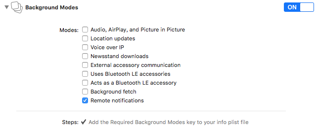
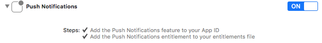

# 海外SDK IOS 使用文档

# 环境要求

> - Mac OS X 10.10以上版本
> - Xcode 7.0以上版本
> - iOS 9.0以上版本

- SDK集成了登录，支付等功能。本文档详细说明相关功能在技术对接与使用过程中需要注意的地方，以便贵方能快速对接。阅读后如有疑问，请联系GM88游戏相关技术支持。
- SDK目前支持语言有：简体中文，繁体中文，繁体中文（台湾），繁体中文（香港），英语，西班牙语，德语，法语，印度尼西亚语，越南语，韩语，日语，意大利语，马来语，葡萄牙语，俄语，泰语

# 准备工作

## 导入SDK

```
将(给到的SDK).framework、GoogleSignIn.bundle、LineSDKReesource.bundle和(根据给到SDK添加).bundle导入到您的工程中。
```

操作：

方式一：在工程目录结构中，右键选择Add Files to...，在弹出的页面中选择 `(根据给到SDK添加).framework`，`GoogleSignIn.bundle`，`LineSDKReesource.bundle`和`(根据给到SDK添加).bundle`，勾选**Copy items into destination group's folder(if needed)**，并确保**Add To Targets勾选相应target**。

方式二：直接将上述文件拖入Xcode工程目录结构中，在弹出的界面中勾选**Copy items into destination group's folder(if needed)**，并确保**Add To Targets勾选相应target**。

## 设置应用方向

SDK V1.4开始，同时支持横竖版，并且两版流程不一致，因此在出包之前必须设置应用方向。

### 1、横版游戏

方法一：

1、**【General】—>【Deployment Info】—>【Device Orientation】**，勾选Landscape Left和Landscape Right。

2、Info.plist中   

```css
  <key>UISupportedInterfaceOrientations</key>
	<array>
		<string>UIInterfaceOrientationLandscapeLeft</string>
		<string>UIInterfaceOrientationLandscapeRight</string>
	</array>
	<key>UISupportedInterfaceOrientations~ipad</key>
	<array>
		<string>UIInterfaceOrientationLandscapeLeft</string>
		<string>UIInterfaceOrientationLandscapeRight</string>
	</array>
```

 方式二：

在AppDelegate中添加

```objectivec
- (UIInterfaceOrientationMask)application:(UIApplication *)application supportedInterfaceOrientationsForWindow:(UIWindow *)window {
   return  UIInterfaceOrientationMaskLandscape;
}
```

  

### 2、竖版游戏

方法一：

1、**【General】—>【Deployment Info】—>【Device Orientation】**，勾选Portrait。

2、Info.plist中   

```css
  <key>UISupportedInterfaceOrientations</key>
	<array>
		<string>UIInterfaceOrientationPortrait</string>
	</array>
	<key>UISupportedInterfaceOrientations~ipad</key>
	<array>
		<string>UIInterfaceOrientationPortrait</string>
		<string>UIInterfaceOrientationPortraitUpsideDown</string>
	</array>
```


方式二：

在AppDelegate中添加

```objectivec
- (UIInterfaceOrientationMask)application:(UIApplication *)application supportedInterfaceOrientationsForWindow:(UIWindow *)window {
    return  UIInterfaceOrientationMaskPortrait|UIInterfaceOrientationMaskPortraitUpsideDown;
}
```


## 添加工程依赖库

当前版本SDK不需要额外依赖库。

## 工程设置

**1、在工程的 Build Setting 中找到 Other Linker Flags 添加  -ObjC**


**2、在工程的 Build Setting 中找到 Enable Bitcode  设置成NO**


**3、由于iOS 9 改为https，如果您的项目有使用http，可在Info.plist中添加如下代码：**（右键Info.plist用source code打开）

```xml
<key>NSAppTransportSecurity</key> 
<dict> <key>NSAllowsArbitraryLoads</key> <true/> 
</dict> 
```

**4、如有游戏需要推送，请开启推送Capabilities中打开Background Modes（勾选Remote notifications）和Push Notifications**如下图所示：





**5、Info.plist文件配置，此配置项是为了line，Facebook，Google登录**

```xml
          <key>CFBundleURLTypes</key>
          <array>
             <dict>
                <key>CFBundleTypeRole</key>
                <string>Editor</string>
                <key>CFBundleURLSchemes</key>
                <array>
                   <string>line3rdp.$(PRODUCT_BUNDLE_IDENTIFIER)</string>
               </array>
            </dict>
            <dict>
            <key>CFBundleTypeRole</key>
                <string>Editor</string>
                <key>CFBundleURLName</key>
                <!---需要替换成对应参数-->
                  <string>com.googleusercontent.apps.113851800254-5romtcbaom6s49osvik1p1bo5m1b66ju</string>
             <key>CFBundleURLSchemes</key>
             <array>
              <!---需要替换成对应参数-->
               <string>com.googleusercontent.apps.113851800254-5romtcbaom6s49osvik1p1bo5m1b66ju</string>
            </array>
            </dict>
            <dict>
            <key>CFBundleTypeRole</key>
                <string>Editor</string>
                 <key>CFBundleURLSchemes</key>
                 <array>
                   <!---需要替换成对应参数-->
                   <string>fb658714061225851</string>
                 </array>
                 </dict>
         </array>

         <key>FacebookAppID</key>
           <!---需要替换成对应参数-->
         <string>658714061225851</string>
         <key>FacebookDisplayName</key>
           <!---需要替换成对应参数-->
         <string>动物战争</string>
           <!---白名单-->
         <key>LSApplicationQueriesSchemes</key>
           <array>
              <string>fbapi</string>
              <string>fb-messenger-api</string>
              <string>fbauth2</string>
              <string>fbshareextension</string>
              <string>lineauth2</string>
           </array>
           <key>LineSDKConfig</key>
           <dict>
           <key>ChannelID</key>
             <!---需要替换成对应参数-->
             <string>1564316537</string>
           </dict> 
      <key>GADIsAdManagerApp</key>
        <true/>
      <key>AppLovinSdkKey</key>
      <!---需要替换成对应参数-->
       <string>OixDcmXAyNNGd4zM3r-h0fsGvPzKc8k0sfETQmdM80dn4b77R6qSmfif4f-hpiheMw7ogl9plnZqNhyqomGTQz</string>
```

**6、设置Build Options**

- 自v1.2.17版本起，SDK中包含swift部分，因此需要在项目中设置Build Options
  
  **在项目的Build Settings中找到Always Embed Swift Standard Libraries 设置成Yes**

# 初始化

- 简介：执行全局设置，用于应用启动后，初始化SDK。（必接接口）

## 引入头文件

```objectivec
#import <loginSDK/platInit.h>
```

## 调用初始化

方法：

> 此方法默认读取bundle中的参数，如使用此初始化方法，请确认给到的SDK的bundle中的infoset.plist所有参数是否与提供的参数表一致。

```objectivec
+ (void) initSDKapplication:(UIApplication *)application
didFinishLaunchingWithOptions:(NSDictionary *)launchOptions
                    Applede:(id) app;
```

**参数**

| 参数名           | 参数类型          | 是否必需 | 示例            | 描述     |
| ------------- | ------------- | ---- | ------------- | ------ |
| application   | UIApplication | 是    | application   | 默认参数   |
| launchOptions | NSDictionary  | 是    | launchOptions | 默认参数   |
| app           | AppDelegate   | 是    | self          | 用于数据打点 |

**示例**

```objectivec
-(BOOL)application:(UIApplication *)application didFinishLaunchingWithOptions:(NSDictionary *)launchOptions 
   [platInit initSDKapplication:application didFinishLaunchingWithOptions:launchOptions Applede:self];
    return YES;
}
```

## SDK资源

- 此为与SDK一起提供的.bundle文件的配置
- 配置参数，可以直接按照运营提供的相关参数表，如有疑问，请联系相关运营人员
- 如对配置参数的key有任何疑问，请联系相关技术人员
- 详见下表，未出现在表中的参数key，则一般不需要修改，如有疑问，请联系相关技术人员

| 参数名           | 参数类型 | 描述                                                         | 示例                                                         |
| ---------------- | -------- | ------------------------------------------------------------ | ------------------------------------------------------------ |
| gameid           | String   | 游戏id                                                       | 1634                                                         |
| channel          | String   | 渠道名称，默认GM，一般不需要修改                             | GM                                                           |
| GGkClientID      | String   | google客户端id                                               | 726483388833-nejr29g354f0p3sieg18gmehkhljuerv.apps.googleusercontent.com |
| appsFlyerDevKey  | String   | appsflyer的key                                               | g7ZP9TqQ4S8AF9zeQD9Koe                                       |
| appleAppID       | String   | 苹果应用id                                                   | 1528141305                                                   |
| Promote          | String   | 渠道id，默认17，代表iOS，无需修改                            | 17                                                           |
| GoogleADID       | String   | admob广告id                                                  | ca-app-pub-7496069579613989~9003527017                       |
| IronsourceAppKey | String   | ironsource的key                                              | ce0a7e2d                                                     |
| issueVersion     | String   | 发布版本                                                     | 1634011                                                      |
| consumerSecret   | String   | twitter的Secret                                              | lGoFe4yYVug52LcNiAptoABgb14k5seN9XMJq6L0ggSzUmIevP           |
| ConsumerKey      | String   | twitter的key（如果无需twitter相关功能，这两个参数可以不修改） | SALb45SZfATPS8ILSYAvnB4ic                                    |
| version          | String   | 相对应配置版本                                               | 3.0                                                          |
| iconControl      | String   | 登录页面是否显示app的icon，1表示使用应用icon，其他表示使用默认图片。 | 1                                                            |

**注：1、issueVersion—发布版本：iOS SDK 1.3版本及其以上版本才有，必须设值，每次出包均需像运营相关人员确认其值；2、version：iOS SDK 1.3版本及其以上版本可以直接设置成1.0；其余版本此值请于相关技术人员确认；3、iconControl：iOS SDK 1.4及其以上版本才有，用于控制登录页面的logo图，请与相关人员联系确认**


## 定义通知

SDK使用通知来接收部分接口的结果，涉及的接口包括：

- 帐号绑定
- 分享
- 变现广告
- 获取商品多语言列表
- 翻译
- vip客服

**定义**

```obj
@"SDKCenterNotifition"
```

**状态值**

| 状态值 | 含义             |
| --- | -------------- |
| 0   | 广告失败           |
| 1   | 广告成功           |
| 2   | 分享失败           |
| 3   | 分享成功           |
| 4   | 绑定失败           |
| 5   | 绑定成功           |
| 6   | 未绑定            |
| 7   | 已绑定            |
| 8   | 绑定取消           |
| 9   | 取消广告           |
| 10  | 返回product多语言   |
| 11  | 返回product多语言失败 |
| 12  | 返回翻译           |
| 13  | VIP专属客服不可显示    |
| 14  | VIP专属客服可显示     |
| 15  | VIP专属客服关闭      |

**示例**

```objectivec
//在viewDidLoad中添加通知
[[NSNotificationCenter defaultCenter] addObserver:self selector:@selector(notifitionCenter:)  name:@"SDKCenterNotifition" object:nil];

-----------------------通知回调方法---------------------------
//自定义方法
#pragma mark - 通知回调事件

/**
  * 返回参数：status  游戏可以根据状态来获知各功能的回调，具体表示如上述表格              
   */
- (void)notifitionCenter :(NSNotification *)notification{
    NSDictionary * Info = (NSDictionary *)notification.object;
    NSLog(@"info==%@",Info);
    if([[Info objectForKey:@"status"] isEqualToString:@"0"]){
        //广告失败 do something
    }else  if([[Info objectForKey:@"status"] isEqualToString:@"1"]) {
        //广告成功 do something
    }else  if([[Info objectForKey:@"status"] isEqualToString:@"2"]) {
        //分享失败 do something
    }else  if([[Info objectForKey:@"status"] isEqualToString:@"3"]) {
        //分享成功 do something
    }else  if([[Info objectForKey:@"status"] isEqualToString:@"4"]) {
        //绑定失败 do something
    }else  if([[Info objectForKey:@"status"] isEqualToString:@"5"]) {
        //绑定成功 do something
    }else  if([[Info objectForKey:@"status"] isEqualToString:@"6"]) {
        //未绑定 do something
    }else  if([[Info objectForKey:@"status"] isEqualToString:@"7"]) {
        //已绑定 do something
    }else  if([[Info objectForKey:@"status"] isEqualToString:@"8"]) {
        //绑定取消 do something
    }
}

---------------------------移除通知--------------------------
//请最后在dealloc方法中移除通知哦
- (void)dealloc
{
    [[NSNotificationCenter defaultCenter] removeObserver:self];
}
```

# 登录登出

简介：此接口用于登录，登录方式有：平台账号密码登录，游客登录，Facebook登录，Line登录。
注：1.2.12及其之后版本因加入了Sign in with apple，需要在项目target->signing&Capabilities->"+"->Sign In with Apple。

## 引入头文件

```objectivec
#import <loginSDK/platLogin>
```

## 登录（必接）

###### 代理

```objectivec
LoginCallBack
```

###### **接口**

```objectivec
+ (void) login:(id<LoginCallBack>)mLoginCallBack;
```

**示例**

```objectivec
[platLogin login:self];
```

## 登出

```objectivec
+ (void)logOut;
```

**示例**

```objectivec
[platLogin logOut];
```

## 重新登陆(切换帐号)

此接口用于游戏中用户可以切换账号的入口，使得用户可以在游戏中切换登录的账号。

```objectivec
+ (void) WithInApplicationSwitch
```

**示例**

```objectivec
[platLogin WithInApplicationSwitch];
```

## 回调

```objectivec
-(void)loginOnFinish:(loginStatus)code   Data:(NSDictionary*)Data
{
    NSLog(@"回调状态值：%ld",(long)code);


    NSLog(@"回调：%@",Data);
    if(code==LOGIN_SUCCESS){
       //登陆成功
    }else if(code ==LOGIN_SWITCH){
       //切换账号无需特殊处理
    }else if(code== LOGOUT_SUCCESS){
       //退出账号 需要主动拉起登陆
    }else if (code == LOGIN_UNUSE) {
      //封号退出程序
      exit(0);
    }
}
```

# 帐号绑定

## 拉起帐号绑定页面

- 此接口用于显示绑定页面，游客可以绑定GM88账号

- 绑定结果在通知中，通知名称为@"SDKCenterNotifition"，详见**SDK通知**
  
  ##### 接口

```objectivec
+ (void)userInfoBindView;
```

**示例**

```objectivec
[platLogin userInfoBindView];
```

**响应** 使用通知来接收回调，请参考[通知](#%E5%AE%9A%E4%B9%89%E9%80%9A%E7%9F%A5)

| 状态值 | 含义   |
| --- | ---- |
| 4   | 绑定失败 |
| 5   | 绑定成功 |
| 8   | 绑定取消 |

## 查询帐号绑定状态

- 此接口用于查询账号是否已绑定，（绑定邮箱，三方之类，只要绑定任何一项即返回绑定状态）
  
```objectivec
+ (void) isCanBind;
```

**示例**

```objectivec
[platLogin isCanBind];
```

**响应** 使用通知来接收回调，请参考[通知](#%E5%AE%9A%E4%B9%89%E9%80%9A%E7%9F%A5)

| 状态值 | 含义  |
| --- | --- |
| 6   | 未绑定 |
| 7   | 已绑定 |

# 支付

## 引入头文件

```objectivec
#import <loginSDK/platPurchase.h>
```

## 发起支付（必接）

###### 代理

```objectivec
PurchaseCallBack
```

此接口用于苹果支付，需要传递相关信息进行支付操作。

**定义**

```objectivec
+ (void) purchase:(purchaseModel *)payInfo CallBack:(id<PurchaseCallBack>) callBack;
```

**参数**

| 参数名          | 类型     | 是否必需 | 描述                                    |
| ------------ | ------ | ---- | ------------------------------------- |
| productID    | string | 是    | 商品ID                                  |
| productName  | string | 是    | 商品名称                                  |
| productPrice | string | 是    | 商品价格                                  |
| productDes   | string | 是    | 商品描述（没有可传递商品名称）                       |
| gameReceipts | string | 是    | 游戏传入的有关用户的区id，服务器id，角色id,订单等，属于透传数据功能 |
| roleID       | string | 否    | 角色ID                                  |
| roleName     | string | 否    | 角色名称                                  |
| roleLevel    | string | 否    | 角色等级                                  |
| vipLevel     | string | 否    | vip等级                                 |
| zoneID       | string | 是    | 服务器ID，若无，请填写“1”                       |
| zoneName     | string | 否    | 服务器名称                                 |
| text         | string | 否    | 文本                                    |
| notifyURL    | string | 否    | 回调地址，可传可不传，不传会使用后台配置的回调地址，请将地址提供给运营   |

**示例代码**

```objectivec
purchaseModel* mPayInfo = [[purchaseModel alloc] init];
mPayInfo.productID=@"xxxxx";
mPayInfo.productName=@"商品名称";
mPayInfo.productPrice=@"6";
mPayInfo.productDes=@"商品描述";
mPayInfo.gameReceipts=receipts;
mPayInfo.roleID=@"";
mPayInfo.roleName=@"";
mPayInfo.roleLevel=@"";
mPayInfo.vipLevel=@"";
mPayInfo.partyName=@"";
mPayInfo.zoneID=@"服务器id";
mPayInfo.zoneName=@"";
mPayInfo.text=@"";
mPayInfo.notifyURL = @"http://demo.wfnji88.com/ok.php?gameid=1156&promote=2";
platPurchase purchase:mPayInfo CallBack:self];
```

###### 回调

```objectivec
- (void)purchaseOnFinish:(purchaseStatus)code Data:(NSDictionary *)Data{
 if (code ==PURCHASE_SUCCESS){
 //支付成功
 } else if (code== PURCHASE_FAILED){
 //支付失败
 } else if (code==PURCHASE_CANCEL){
 //支付取消
 } else if (code==PURCHASE_UNKNOWN){
 //支付未知
 }
}
```

## 引入头文件

```objectivec
#import <loginSDK/platTools.h>
```

## 查询商品币种

调用此接口，可以返回相应的商品多语言列表。

**接口**

```objectivec
+ (void)setPurchaseInfo;
```

**响应**

使用通知来接收回调，请参考[通知](#定义通知)

| 状态值 | 含义                               |
| --- | -------------------------------- |
| 10  | 返回商品列表失败                         |
| 11  | 返回商品列表成功，@“product”中的值为商品多语言列表内容 |

# 角色

## 角色信息变更（必接）

- 上传和角色相关的打点，状态值：1、创建角色，2、完成新手引导，3、等级升级

```objectivec
/**
  * 当前游戏的角色打点
  * @param name     角色名字
  * @param level    游戏等级
  * @param serverID 区服ID
  * @param roleid   角色ID
  * @param status   1:创建角色 2:完成新手引导 3:等级升级  状态值默认选择<3>
  * @param vipLevel 游戏VIP等级
  */
+ (void)platRoleName:(NSString *)name
            gameLevel:(NSString *)level
             serverID:(NSString *)serverID
               roleID:(NSString *)roleid
               status:(NSString *)status
         vipLevel:(NSString *)vipLevel;
```

**参数**
| 参数名   | 类型   | 必需 | 说明                                 |
| -------- | ------ | ---- | ------------------------------------ |
| name     | string | 是   | 角色名                               |
| level    | string | 是   | 等级                                 |
| severID  | string | 是   | 区服ID                               |
| roleID   | string | 是   | 角色ID                               |
| status   | string | 是   | 1:创建角色 2:完成新手引导 3:等级升级 |
| vipLevel | string | 否   | 游戏内vip等级，如果没有，可以传空    |


**示例**
此处示例为角色升级

```objectivec
[platTools platRoleName:@"角色名字" gameLevel:@"角色等级" serverID:@"区服ID" roleID:@"角色ID" status:@"3" vipLevel:@""];
```

# 分享

## 发起分享

- 此接口用于接入分享
- 分享的结果在通知中，通知名称为@"SDKCenterNotifition"，详见**SDK通知**

```objectivec
/**
 分享使用的方法

 @param sharename 分享名
 @param shareID 分享ID
 @param share_uname 角色名
 @param share_server 角色区服
 @param share_code 角色code

 */
+ (void)ShareInfoName:(NSString *)sharename
                  ShareInfoID:(NSString *)shareID
                   shareUname:(NSString *)share_uname
                  shareServer:(NSString *)share_server
                   shareCode :(NSString *)share_code;
```

**示例**

> 相关参数如有不清楚，请与相关人员联系

```objectivec
[platTools ShareInfoName:@"分享" ShareInfoID:@"1" shareUname:@"w" shareServer:@"w" shareCode:@"w"];
```

**响应**

使用通知来接收回调，请参考[通知](#定义通知)

| 状态值 | 含义   |
| --- | ---- |
| 2   | 分享失败 |
| 3   | 分享成功 |


## 分享方式

此接口用于接入分享

分享的结果在通知中，通知名称为@"SDKCenterNotifition"，详见**SDK通知**

```objectivec
/**
 分享使用的方法
 
 @param text 分享文本
 @param image 图片，可以传空，传一张
 @param link 分享链接
 @param type 分享类型：1 引文分享（链接），2 图片分享,3 使用SDK后台配置分享
 @param info SDK后台配置分享，需要传入参数格式如下：
            @{@"shareName":@"分享名称",
                @"shareID":@"分享ID",
             @"shareUName":@"角色名",
            @"shareServer":@"角色区服",
              @"shareCode":@"角色code"
 
             }
 */
+ (void)shareInfo:(NSString *)text image:(UIImage *)image link:(NSString *)link type:(NSString *)type otherInfo:(NSDictionary *)info;

```

参数

| 参数名 | 类型         | 说明                                                         |
| ------ | ------------ | ------------------------------------------------------------ |
| type   | NSString     | 分享类型：1、 引文分享（链接分享），2、图片分享，3、使用SDK后台配置的分享 |
| text   | NSString     | 分享文本（没有可以传空）                                     |
| image  | UIImage      | 图片（没有可以传空，分享类型为2、图片分享时，请传递图片）    |
| link   | NSString     | 分享链接                                                     |
| info   | NSDictionary | 分享类型为3时，必须设置相关内容SDK后台配置分享，需要传入参数格式如下：<br/>            @{@"shareName":@"分享名称",<br/>                       @"shareID":@"分享ID",<br/>             @"shareUName":@"角色名",<br/>               @"shareServer":@"角色区服",<br/>                 @"shareCode":@"角色code" }<br/>其余类型时可以传空。 |

**示例**

> 相关参数如有不清楚，请与相关人员联系

```objectivec
[platTools shareInfo:@"分享测试" image:[UIImage imageWithContentsOfFile:[[NSBundle mainBundle] pathForResource:@"wait" ofType:@"png"]] link:@"https://www.baidu.com" type:@"2" otherInfo:@{}];
```

**响应**

使用通知来接收回调，请参考[通知](#定义通知)

| 状态值 | 含义     |
| ------ | -------- |
| 2      | 分享失败 |
| 3      | 分享成功 |


# 变现广告

## 拉起激励视频接口

此接口是用于接入广告的，目前只用于激励视频。

```objectivec
+ (void)choseADPlatForm;
```

**示例**

```objectivec
[platTools choseADPlatForm];
```

**响应**

使用通知来接收回调，请参考[通知](#定义通知)

| 状态值 | 含义   |
| --- | ---- |
| 0   | 广告失败 |
| 1   | 广告成功 |
| 9   | 取消广告 |

## 设置广告次数接口

此接口用于设置广告剩余次数，用于减少广告预加载。不设置，默认加载。

```objectivec
+ (void)ADCounts:(NSString *)str;
```

**示例**

```objectivec
[platTools ADCounts:@"3"];
```

## 拉起广告接口

此接口适用于接入广告的。

```objectivec
+ (void)choseADPlatForm:(NSInteger)type;
```

**参数**

传入的type值，及其含义如下表所示：

| 参数值 | 含义   |
| --- | ---- |
| 0   | 激励视频 |
| 1   | 插页广告 |
| 2   | 横幅广告 |

**示例**

```objectivec
[platTools choseADPlatForm:0];
```

**响应**

使用通知来接收回调，请参考[通知](#定义通知)

| 状态值 | 含义   |
| --- | ---- |
| 0   | 广告失败 |
| 1   | 广告成功 |
| 9   | 取消广告 |

# 客服

## 客服中心

此接口用于显示客服中心

```objectivec
+ (void)showCustomView;
```

**示例**

```objectivec
[platTools showCustomView];
```

**响应**

打开客服页面。

## VIP专属客服

### 查询是否可显示VIP客服

- 此接口用于查询是否可显示VIP专属客服（只有符合相关条件的vip，才会返回可以显示）
- 结果在通知中，通知名称为@"SDKCenterNotifition"，详见**SDK通知**

```objectivec
+ (void)isCanVip;
```

**示例**

```objectivec
[platTools isCanVip];
```

**响应**

使用通知来接收回调，请参考[通知](#定义通知)

| 状态值 | 含义          |
| --- | ----------- |
| 13  | VIP专属客服不可显示 |
| 14  | VIP专属客服可显示  |

### VIP专属客服

- 此接口用于显示VIP专属客服
- 结果在通知中，通知名称为@"SDKCenterNotifition"，详见**SDK通知**

```objectivec
+ (void)VIPCustomService;
```

**示例**

```objectivec
[platTools VIPCustomService];
```

**响应**

使用通知来接收回调，请参考[通知](#定义通知)

| 状态值 | 含义          |
| --- | ----------- |
| 13  | VIP专属客服不可显示 |
| 14  | VIP专属客服可显示  |
| 15  | VIP专属客服关闭   |

## 常见问题

此接口用于打开常见问题页面。

```objectivec
+ (void)showFAQView;
```

**示例**

```objectivec
[platTools showFAQView];
```

**响应**

显示常见问题页面。

# 数据打点

## 游戏内行为打点

- 除特定打点外，所有自定义打点的事件都通过此接口传递。

```objectivec
+ (void)LogInfo:(NSString *)eventName EventDic:(NSDictionary *)info;
```

**参数**

| 参数名       | 类型           | 描述                   | 示例                |
| --------- | ------------ | -------------------- | ----------------- |
| eventName | NSString     | 事件名称                 | @"enter game"     |
| info      | NSDictionary | 事件其他参数，用于细分数据(如无可传空) | @{@"userId":@"1"} |

**示例**

```objectivec
//如无其他额外信息，EventDic请传nil(空)
[platTools LogInfo:@"achieve xxx"  EventDic:nil];

```

# 推送

推送是服务端用特定的条件（比如：给特定用户）发送消息，可以在用户关闭应用或者在开启时收到特定的消息（比如：最新活动等）。用户点击即可打开相关内容页。

## 推送工程设置

接入推送，需要在工程中开启推送的开关，请参考[工程设置](#工程设置)

## 发送推送接口

```objectivec
// 推送相关，注册设备信息
+ (void)application:(UIApplication *)application
didRegisterForRemoteNotificationsWithDeviceToken:(NSData *)deviceToken ;
// 推送相关，接收推送信息
+ (void)application:(UIApplication *)application didReceiveRemoteNotification:(NSDictionary *)userInfo;
```

**示例**

- 原生项目的AppDelegate（或者是引擎生成类似方法）如下方法中调用SDK的推送相关的接口

```objectivec
//注册远程通知的设备token
-(void)application:(UIApplication *)application didRegisterForRemoteNotificationsWithDeviceToken:(NSData *)deviceToken {
    [platInit application:application didRegisterForRemoteNotificationsWithDeviceToken:deviceToken];
}

//获取远程通知
-(void)application:(UIApplication *)application didReceiveRemoteNotification:(NSDictionary *)userInfo {
    [platInit application:application didReceiveRemoteNotification:userInfo];
}
```

# 其他接口（必接）

- 所有接口都必须接入，每个接口具体含义，请看示例代码

## 示例代码

```objectivec
//这些方法需在AppDelegate（引擎生成相对应的类）中实现，这些方法必须接入，不接入会影响数据打点，推送以及Facebook等相关功能
//记录应用进入后台
- (void)applicationDidEnterBackground:(UIApplication *)application {
     //此接口用于应用进入后台，功能结合打点，推送等
     [platInit applicationDidBecomeActive:application];
}

//记录应用即将进入前台
- (void)applicationWillEnterForeground:(UIApplication *)application {
     [platInit applicationWillEnterForeground:application];
}

//应用被激活
- (void)applicationDidBecomeActive:(UIApplication *)application {      
     [platInit applicationDidBecomeActive:application];
}

//跳转链接两接口均需接入
//跳转链接，此接口用于比如Facebook登录时的跳转iOS9之后的方法
-(BOOL)application:(UIApplication *)app openURL:(NSURL *)url options:(NSDictionary<NSString *,id> *)options{
    return [platInit application:app openURL:url options:options];
}

//跳转链接，此接口用于比如Facebook登录时的跳转iOS9之前的方法
-(BOOL)application:(UIApplication *)application openURL:(NSURL *)url sourceApplication:(NSString *)sourceApplication annotation:(id)annotation{
    return  [platInit application:application openURL:url sourceApplication:sourceApplication annotation:annotation];
}
```

# 工具型接口

## 获取当前手机系统语言和地区

```objectivec
+ (NSString *)returnLanguageCode;
```

**响应**

返回示例: "zh-CN"。

其中，前半部分表示语言，zh代表中文，后半部分代码地区，CN代表中国。如果只要按语言判断，请只判断前半部分，如果只需按地区判断，请只判断后半部分。因为一种语言会在多个地区出现，一个地区也会有多种语言。

语言码的ISO标准： [ISO 639-1](https://en.wikipedia.org/wiki/List_of_ISO_639-1_codes)

地区码的ISO标准：[ISO 3166-2](https://en.wikipedia.org/wiki/ISO_3166-2)

> 注意，由于Apple并没有完全按ISO标准返回，各厂商系统给出的语言地区码也不完全按ISO标准返回，建议做后端判断，方便兼容
> 常见的不兼容是，中文简体使用的语言码是zh-Hans

## 获取SDK版本

- 此接口用来获取当前SDK的版本，请按需接入

```objectivec
+(NSString*)versions;
```

**示例**

```objectivec
//返回版本号，是string类型
[platTools versions];
```

## 打开社交平台

```objectivec
方式一：
+ (void) toastplatformCode:(NSString *)code Info:(NSString *)info  pageID:(NSString *)pageid;
```

**参数**

| 字段     | 类型     | 说明                            |
| ------ | ------ | ----------------------------- |
| code   | string | code : 2 Facebook 3 洛比 4 应用商店 |
| info   | string | 链接地址/包名/应用ID (无参数默认给个空字符)     |
| pageid | sring  | 粉丝页ID(无参数默认给个空字符)             |

**示例**

```objectivec
[platTools toastplatformCode:@"2" Info:@"https://123" pageID:[info objectForKey:@"12345678"]]
```

```objectivec
方式二：
+ (void)showMarkViewType:(NSInteger)type;
```

**参数**

| 字段   | 类型  | 说明            |
| ---- | --- | ------------- |
| type | int | 1：应用商店；2：三方平台 |

**示例**

```objectivec
[platTools showMarkViewType:2];
```

## 获得手机所在的时区

当游戏需要获取当前用户手机时间所在时区时，调用此方法

```objectivec
+ (NSString *)returnTimeZome
```

**示例**

```objectivec
[platTools returnTimeZome ];
```

## 翻译文本

当需要翻译文字时，请调用此方法

第一个参数text是传入需要的翻译的文本，identifier是cp传来的透传字段。

```objectivec
+ (void)translateText:(NSString *)text identifier:(NSString *)identifier;
```

**参数**

| 参数         | 类型     | 必须  | 说明     |
| ---------- | ------ | --- | ------ |
| text       | string | 是   | 需要翻译文本 |
| identifier | string | 否   | 文本标识符  |

**示例**

```objectivec
[platTools translateText:@"你好" identifier:@"2"];
```

**响应**

结果回调在通知中，会包含状态值，翻译后的文本，文本标识符。

## 日志

当接入需要开启日志时，请调用此方法

```objectivec
+ (void)openLog:(BOOL)isOn;
```

**参数**

| 参数   | 类型   | 必须  | 说明     |
| ---- | ---- | --- | ------ |
| isOn | BOOL | 是   | 是否开启日志 |

**示例**

```objectivec
[platTools openLog:YES];
```

**响应**

开启日志，运行时，控制台输出日志；关闭日志，运行时，控制台不输出日志。

## 打开网页

当需要在游戏内打点某个链接，请调用此方法

```objectivec
+ (void)showViewWithStr:(NSString *)str;
```

**参数**

| 参数 | 类型     | 必须 | 说明           |
| ---- | -------- | ---- | -------------- |
| str  | NSString | 是   | 需要打开的链接 |

**示例**

```objectivec
[platTools showViewWithStr:@"链接"];
```

**响应**

在游戏中弹出链接指向web页面。

